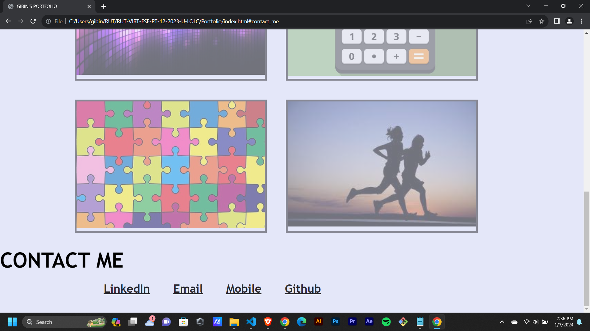

# Portfolio

The Portfolio includes a navigation bar where it is having an avatar, links to sections about me, my work, how to contact me and my resume.
This Portfolio is created as part of the Module 2 Challenge.

index.html defines the structure of the webpage.

style.css is used to provide various styles to the webpage.

links will function correctly in this portfolio.
When I click one of the links in the navigation, then the UI scrolls to the corresponding section.

The Portfolio is having a responsive layout that adapts to any viewport.

CSS selectors and properties are consolidated and organized.

CSS file is properly commented.

* The URL of the deployed application - https://gibinmgeorge.github.io/Portfolio

* The URL of the GitHub repository - https://github.com/GibinMGeorge/Portfolio

screenshots - 

